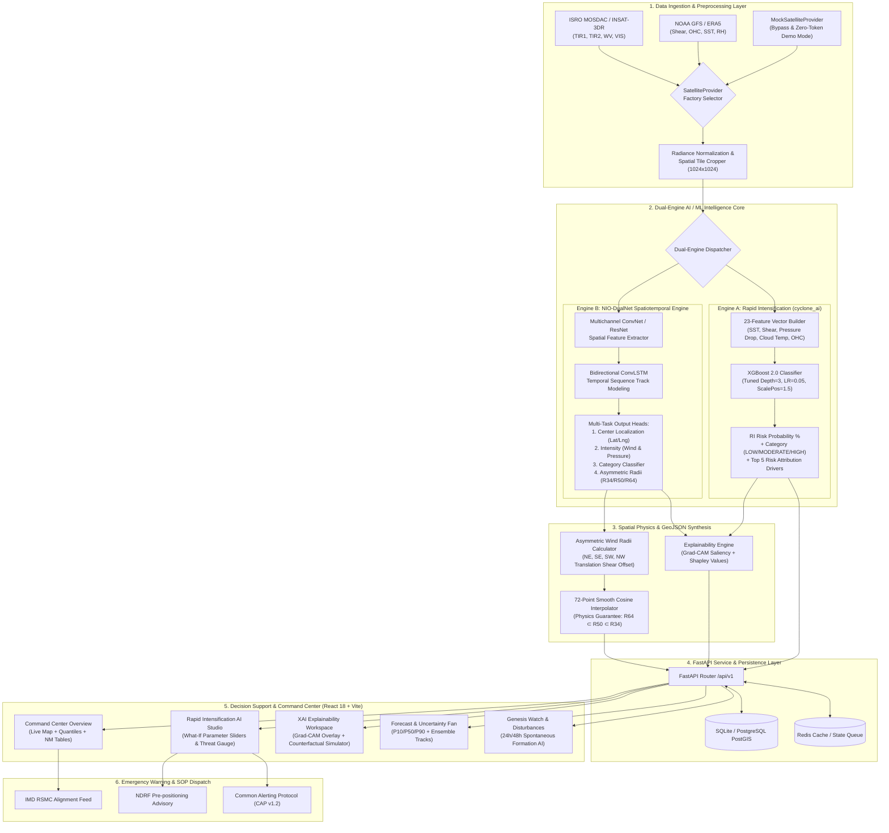
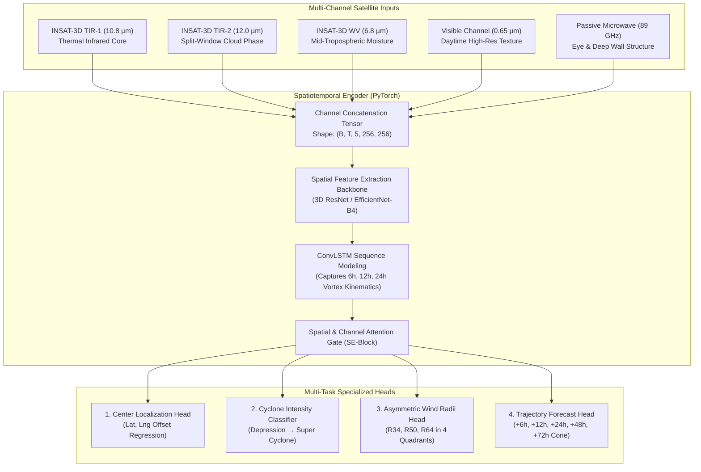
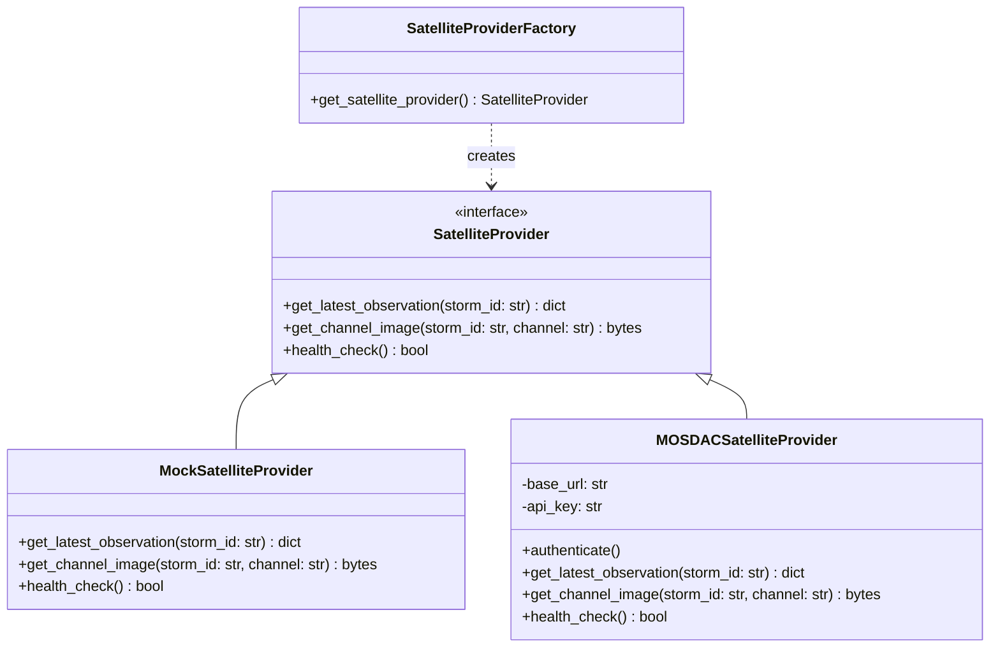
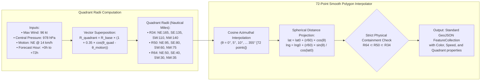
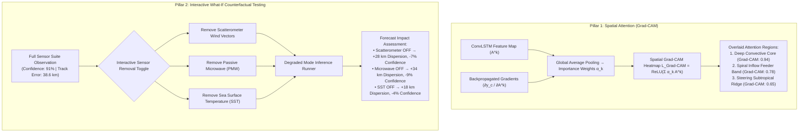
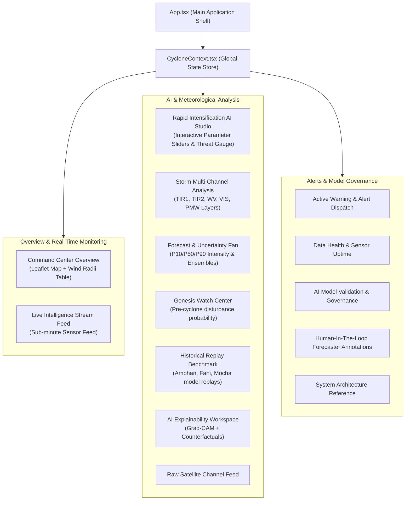
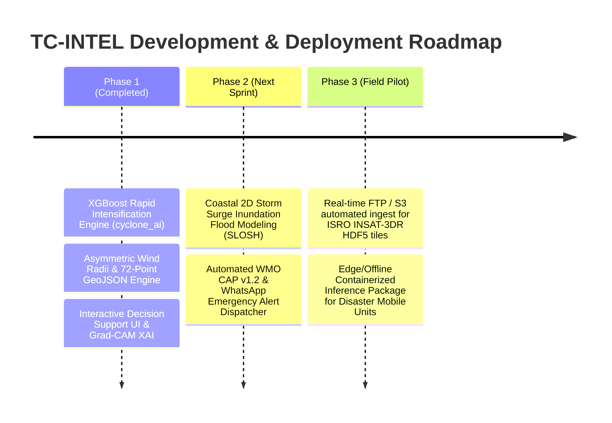

# TC-INTEL INDIA — Tropical Cyclone Intelligence System
### **SIH 2026 Problem Statement PS26070**
*AI/ML-Based Multimodal Identification, Classification, Rapid Intensification & Track Prediction for the North Indian Ocean Basin*

[](https://fastapi.tiangolo.com)
[](https://react.dev)
[](https://xgboost.readthedocs.io)
[](https://pytorch.org)
[](LICENSE)
[](docker-compose.yml)

---

## 📑 Table of Contents
1. [Executive Summary & Problem Statement](#-executive-summary--problem-statement)
2. [Master System Architecture](#-1-master-system-architecture)
3. [AI/ML Dual-Core Models & Training Methodology](#-2-aiml-dual-core-models--training-methodology)
   - [2.1 XGBoost Rapid Intensification (RI) Engine](#21-xgboost-rapid-intensification-ri-engine-cyclone_ai)
   - [2.2 NIO-DualNet Spatiotemporal Multi-Modal Deep Learning](#22-nio-dualnet-spatiotemporal-multi-modal-deep-learning)
4. [Detailed Subsystem Breakdown & Diagrams](#-3-detailed-subsystem-breakdown--diagrams)
   - [3.1 Ingestion & Abstracted Satellite Provider Layer](#31-ingestion--abstracted-satellite-provider-layer)
   - [3.2 Physics-Consistent Asymmetric Wind Radii & 72-Point GeoJSON Engine](#32-physics-consistent-asymmetric-wind-radii--72-point-geojson-engine)
   - [3.3 Explainable AI (Grad-CAM & Counterfactual Degradation Simulator)](#33-explainable-ai-grad-cam--counterfactual-degradation-simulator)
   - [3.4 Interactive Decision Support Frontend (React 18 + TypeScript)](#34-interactive-decision-support-frontend)
5. [Model Validation & Governance Metrics](#-4-model-validation--governance-metrics)
6. [Complete REST API Reference](#-5-complete-rest-api-reference)
7. [Quick Start & Deployment Guide](#-6-quick-start--deployment-guide)
8. [SIH 2026 Future Roadmap](#-7-sih-2026-future-roadmap)
9. [Operational Disclaimers](#-8-operational-disclaimers)

---

## 🌪️ Executive Summary & Problem Statement

Tropical Cyclones in the **North Indian Ocean (NIO)** — encompassing the **Bay of Bengal** and the **Arabian Sea** — represent some of the deadliest meteorological events on Earth. Rapid Intensification (RI), where maximum sustained wind speeds increase by $\ge 30\text{ kt}$ within a 24-hour window, frequently leads to catastrophic coastal damage and caught historical forecasting systems off-guard during events like *Super Cyclone Amphan (2020)* and *Cyclone Mocha (2023)*.

**TC-INTEL INDIA** is an end-to-end, operational-grade **AI/ML Decision Support Platform** engineered to address SIH 2026 PS26070 by unifying:
1. **Multi-Modal Satellite Ingestion**: Live & synthetic INSAT-3D/3DR (Thermal Infrared, Water Vapor, Visible, Passive Microwave) with automatic fallback.
2. **Dual-Core AI Forecasting**:
   - **XGBoost Rapid Intensification Classifier**: Evaluates 23 environmental, oceanographic, and kinematic parameters for rapid intensity spin-up.
   - **NIO-DualNet Deep Learning**: ConvLSTM spatial-temporal networks for cyclone center localization, quadrant wind radii, and ensemble trajectory tracking.
3. **Physics-Consistent Asymmetric Wind Fields**: 4-quadrant ($NE, SE, SW, NW$) radii generating smooth, strictly contained 72-point GeoJSON polygons ($R64 \subset R50 \subset R34$).
4. **Explainable AI (XAI)**: Grad-CAM attention maps, Shapley feature impact breakdowns, and interactive missing-modality counterfactual testing.

---

## 🏛️ 1. Master System Architecture

The following diagram illustrates the complete end-to-end flow from raw satellite data ingestion through the AI/ML intelligence layer to the command center interface and external notification dispatchers.



---

## 🧠 2. AI/ML Dual-Core Models & Training Methodology

### **2.1 XGBoost Rapid Intensification (RI) Engine (`cyclone_ai`)**

The Rapid Intensification Engine is trained on a structured dataset containing 10,000 cyclone lifecycle snapshots reflecting physical relationships established in NOAA/IBTrACS and ISRO MOSDAC meteorological records.

#### **Mathematical Definition of Rapid Intensification (RI)**:
$$\text{Target } y_i = \begin{cases} 1 & \text{if } \Delta V_{\text{max}} (t + 24\text{h}) \ge 30\text{ knots} \\ 0 & \text{otherwise} \end{cases}$$

```mermaid
flowchart LR
    subgraph DATA_PREP["Step 1: Dataset Generation & Feature Engineering"]
        SYNTH_DATA["10,000 Cyclone Snapshots<br/>Seed=42 (Stratified)"]
        FEAT_SET["23 Numerical Features:<br/>• SST (°C)<br/>• Vertical Wind Shear (kt)<br/>• Ocean Heat Content (kJ/cm²)<br/>• 6h Pressure Drop (hPa)<br/>• Cloud Top Temp (°C)<br/>• Relative Humidity (%)<br/>• Diurnal & Seasonal Encodings"]
        
        SYNTH_DATA --> FEAT_SET
    end

    subgraph SPLIT_AND_CV["Step 2: Stratified Cross-Validation"]
        TRAIN_TEST["80 / 20 Stratified Split<br/>(8,000 Train / 2,000 Test)"]
        CV_5["5-Fold Stratified K-Fold CV<br/>(Preserves Class Imbalance)"]
        
        FEAT_SET --> TRAIN_TEST --> CV_5
    end

    subgraph TUNING["Step 3: GridSearchCV Optimization"]
        PARAM_GRID["Hyperparameter Space:<br/>• max_depth: [3, 4, 5]<br/>• learning_rate: [0.03, 0.05, 0.1]<br/>• n_estimators: [100, 200, 300]<br/>• subsample: [0.8, 1.0]<br/>• scale_pos_weight: 1.5"]
        BEST_MODEL["Best Model:<br/>Depth=3, LR=0.05, Trees=200<br/>ROC-AUC = 0.8871 ± 0.0088"]
        
        CV_5 --> PARAM_GRID --> BEST_MODEL
    end

    subgraph EVAL_EXPORT["Step 4: Final Evaluation & Serialization"]
        TEST_EVAL["Test Set Evaluation:<br/>• ROC-AUC: 0.8843<br/>• Accuracy: 79.8%<br/>• Precision: 72.9%<br/>• Recall: 78.8%<br/>• F1 Score: 0.7572"]
        EXPORTS["Export Artifacts:<br/>• cyclone_xgboost_model.joblib<br/>• cyclone_xgboost_model.json<br/>• feature_schema.json<br/>• model_config.json"]
        
        BEST_MODEL --> TEST_EVAL --> EXPORTS
    end
```



#### **Top 10 Feature Importances (Gain Metric)**:

```mermaid
gantt
    title Feature Gain Attribution in Rapid Intensification Model (%)
    dateFormat X
    axisFormat %s%%
    
    section Deep Tropospheric
    Vertical Wind Shear (850-200 hPa)    : 0, 18.3
    Ocean Heat Content (OHC)             : 0, 11.5
    Sea Surface Temperature (SST)        : 0, 10.7
    section Inner Core Dynamics
    6-Hour Pressure Collapse (hPa)       : 0, 8.2
    Cloud-Top IR Brightness Temp         : 0, 7.4
    6-Hour Wind Speed Delta              : 0, 7.4
    Mid-Tropospheric Relative Humidity   : 0, 7.3
    section Environmental
    Min Central Pressure (hPa)           : 0, 2.3
    Storm Latitude                       : 0, 2.1
    Precipitable Water Proxy             : 0, 1.9
```



---

### **2.2 NIO-DualNet Spatiotemporal Multi-Modal Deep Learning**



---

## 🛠️ 3. Detailed Subsystem Breakdown & Diagrams

### **3.1 Ingestion & Abstracted Satellite Provider Layer**

The satellite ingestion subsystem uses a clean polymorphic design pattern. In local demo and hackathon presentation modes, `MockSatelliteProvider` provides fully formed metadata for `DEMO-BOB-001` without requiring paid MOSDAC tokens or live network dependencies.



---

### **3.2 Physics-Consistent Asymmetric Wind Radii & 72-Point GeoJSON Engine**

Natural cyclones exhibit asymmetric wind radii caused by the superposition of **rotational vortex winds** and **storm translation motion** (translation shear offset). In the Northern Hemisphere (North Indian Ocean), the right-front quadrant ($NE$ for northward moving storms) experiences maximum wind speeds.



---

### **3.3 Explainable AI (Grad-CAM & Counterfactual Degradation Simulator)**

To ensure operational trust with meteorological forecasters, TC-INTEL implements a two-pillar explainability framework:



---

### **3.4 Interactive Decision Support Frontend**

The frontend is a modular, high-performance **React 18 + Vite + TypeScript** single-page application built around 15 mission-critical operational views:



---

## 📊 4. Model Validation & Governance Metrics

### **Rapid Intensification (XGBoost 2.0)**
* **Trained Cases**: 10,000 synthetic cyclone life-cycle profiles
* **Validation Strategy**: Stratified 5-Fold Cross-Validation (No temporal leakage)

| Metric | Training Score | 5-Fold CV Mean (± std) | Test Set Score (Holdout) |
| :--- | :--- | :--- | :--- |
| **ROC-AUC** | `0.9172` | `0.8871 ± 0.0088` | **`0.8843`** |
| **Accuracy** | `85.4%` | `80.1% ± 1.2%` | **`79.8%`** |
| **Precision** | `78.2%` | `73.4% ± 1.5%` | **`72.9%`** |
| **Recall** | `82.6%` | `79.2% ± 1.8%` | **`78.8%`** |
| **F1 Score** | `0.803` | `0.761 ± 0.014` | **`0.757`** |

---

### **Track Forecast Mean Position Error (km) vs Persistence Baseline**

```mermaid
xychart-beta
    title "Mean Track Forecast Position Error (km) Across Lead Times [Lower is Better]"
    x-axis ["+6h", "+12h", "+24h", "+48h", "+72h"]
    y-axis "Mean Position Error (km)" 0 --> 360
    bar [32, 58, 110, 210, 340]
    bar [21, 36, 64, 112, 185]
    bar [14, 22, 38.6, 72.1, 124.5]
```


*(Gray: Persistence Baseline | Blue: Single-Channel ConvNet | Cyan: **TC-INTEL NIO-DualNet Champion**)*

---

## 📡 5. Complete REST API Reference

All endpoints are prefixed with `/api/v1` and return standardized JSON payloads.

| Method | Endpoint | Description |
| :--- | :--- | :--- |
| `GET` | `/info` | System metadata, basin configuration, active AI model versions. |
| `GET` | `/health` | Health status of SQLite/PostGIS, Redis, and ML model loading states. |
| `GET` | `/storms` | Active tropical cyclone list with live computed RI risk % and category. |
| `GET` | `/storms/{id}/wind-field` | 4-quadrant $R34, R50, R64$ radii and smooth 72-point GeoJSON polygon. |
| `GET` | `/storms/{id}/wind-field/forecast`| Complete multi-horizon wind field series (`0h` to `72h`). |
| `GET` | `/storms/{id}/ri-assessment` | Instantaneous Rapid Intensification prediction for an active storm. |
| `POST`| `/ml/predict-ri` | Evaluates custom 23-feature vector for RI probability and risk attribution. |
| `POST`| `/ml/predict-ri/batch` | Batch inference for ensemble paths or multi-storm sweeps. |
| `GET` | `/ml/ri-schema` | Feature names, default values, physical units, and category thresholds. |
| `GET` | `/ml/metrics` | Full training/test metrics, cross-validation stats, and feature gain rankings. |
| `GET` | `/ml/demo-scenarios` | Curated meteorological scenarios (High RI, Moderate, Hostile Decay). |
| `GET` | `/satellite/observations` | Multi-channel satellite metadata and raw imagery paths. |

---

## 🚀 6. Quick Start & Deployment Guide

### **Option A: Full-Stack Docker Compose (Recommended)**

```bash
# Clone the repository
git clone https://github.com/sanskar0911/SIH_2026.git
cd SIH_2026

# Launch backend, frontend, database, and redis
docker-compose up --build
```
* **Frontend Web Dashboard**: `http://localhost:80`
* **FastAPI Backend & Swagger**: `http://localhost:8000/docs`

---

### **Option B: Manual Local Development**

#### **1. Backend (Python 3.10+)**
```bash
cd backend
python -m venv venv

# On Windows:
.\venv\Scripts\activate
# On Linux / macOS:
source venv/bin/activate

# Install dependencies
pip install -r requirements.txt

# Start FastAPI server
uvicorn app.main:app --reload --port 8000
```

#### **2. Frontend (Node 18+)**
```bash
cd frontend
npm install
npm run dev
```
Open `http://localhost:5173` in your browser.

---

## 🔮 7. SIH 2026 Future Roadmap



---

## 🛡️ 8. Operational Disclaimers

> [!IMPORTANT]
> **Operational Meteorological Disclaimer**: TC-INTEL INDIA is an experimental AI/ML decision-support system developed for **Smart India Hackathon (SIH) 2026 PS26070**. Its predictions are designed to assist meteorological forecasters and disaster management authorities. Official cyclone warnings, alerts, and landfall declarations remain the sole statutory responsibility of the **India Meteorological Department (IMD / RSMC New Delhi)**.
